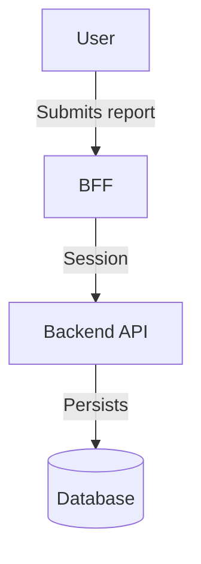

# DOCUMENTATION

## General principles

* Each new and changed functionality must be documented **before the merge request is merged**
* Documents are stored in the `docs/` folder in the project root directory (except `README.md` and `CHANGELOG.md`)
* Documents are under version control alongside code — code without documentation is wrong
* Documentation and repository deliverables default to **English** (`README.md`, `CHANGELOG.md`, `AGENTS.md`, `docs/*`, ADRs, API descriptions)
* Estonian is permitted in documentation only when the user provides a separate prior instruction for specific work

## Mandatory artifacts

| File or folder | Content | Location |
|----------------|---------|----------|
| `README.md` | Project overview documentation | Root |
| `AGENTS.md` | AI agent context description — project, structure, conventions | Root |
| `CHANGELOG.md` | Release notes, change history | Root |
| `docs/architecture/` | Architecture descriptions, component diagrams | `docs/` |
| `docs/data-model/` | ERD, data model descriptions | `docs/` |
| `docs/processes/` | Business processes (BPMN), flow diagrams | `docs/` |
| `docs/api/` | OpenAPI specification | `docs/` |
| `docs/adr/` | Architecture decision record (ADR) | `docs/` |
| `.env.example` | All required environment variables | Root |

## README.md structure

Every repository must contain an **English** `README.md` with at least the following sections:

```markdown
# Project Name

Short description of what the project does and who it is for.

## Prerequisites
Required tools and versions (Node 20+, Java 21+, Docker, etc.).

## Local Development Setup
Step-by-step instructions so a new developer can start without extra support.

## Configuration
Environment variables and their descriptions (reference `.env.example`).

## Testing
How to run tests and what to validate in coverage reports.

## Architecture
Short architecture summary and links to `docs/architecture/`.

## Contributing
Branch strategy, commit conventions, and MR process (reference `git.md` rules).
```

## Code documentation

* Follow the standard for each language:
  * **Java/Kotlin:** Javadoc (`/** */`)
  * **TypeScript/JavaScript:** TSDoc (`/** @param ... @returns ... */`)
  * **Python:** Docstring (Google style or NumPy style)
* Document **WHAT** and **WHY** — not **HOW** (that is visible from the code)
* Public APIs (public methods, exported functions) must **always** be documented
* Internal logic: comment only non-obvious complex areas

```typescript
/**
 * Calculates the approval deadline based on submission date and report type.
 * Weekends and public holidays are excluded from the calculation.
 *
 * @param submittedAt - The timestamp when the report was submitted
 * @param reportType - Determines the number of working days allowed
 * @returns The deadline as an ISO 8601 timestamp
 */
function calculateApprovalDeadline(submittedAt: Date, reportType: ReportType): Date { ... }
```

## Architecture documents

* **Component diagram** — shows the main system components and relationships between them
* **Sequence diagram** — for critical user flows (e.g. authentication, approval process)
* **ERD (Entity-Relationship Diagram)** — data model, table relationships
* **BPMN process diagram** — business process description (use `.bpmn` format)

Diagrams are preferably stored in text-based formats (Mermaid, PlantUML) so they can be diffed:



## AGENTS.md structure

Every repository must include `AGENTS.md`. If it is missing, the agent must create it before starting work (see the `analyze-codebase` workflow).

`AGENTS.md` is **for the agent**, not for developers — it is project context that helps the agent begin work immediately. Content is written in English. The agent updates this file whenever it discovers changes to project structure or conventions.

```markdown
# AGENTS.md

## Project Overview
[What this system does and for whom]

## Repository Structure
[Main folders and their purpose]

## Technology Stack
[Language, framework, database, authentication]

## Key Conventions
[UUID versions, auth pattern, coverage target, language conventions]

## Branch Strategy
[Short overview of branches and flow]

## References
[README, docs/, rules/, or project `.cursor/rules/`]
```

* `AGENTS.md` is kept in the **project root**
* Update when the technology stack, structure, or important conventions change
* Must not contain sensitive information (secrets, passwords)

## Architecture decision record (ADR)

Important technical decisions are documented in `docs/adr/`. An ADR answers: **"Why did we choose solution X?"**

### ADR format

```markdown
# ADR-001: [Decision Title]

## Status
Accepted | Superseded by ADR-XXX | Rejected

## Context
[What problem existed? What constraints applied?]

## Decision
[What we decided and why]

## Alternatives
[What other options we considered and why they were not suitable]

## Consequences
[What changes as a result of this decision — positive and negative]
```

### When to create an ADR

* Choosing new technology or a framework (e.g. "why PostgreSQL, not MongoDB?")
* Choosing an architecture pattern (e.g. "why BFF, not direct backend?")
* Establishing an important convention (e.g. "why UUID v7?")
* Documenting a deliberate trade-off

### ADR rules

* ADRs are **immutable** — they are not modified. A new decision → a new ADR that references the previous one
* Naming: `docs/adr/ADR-001-decision-title.md`
* ADRs are under version control alongside the code

