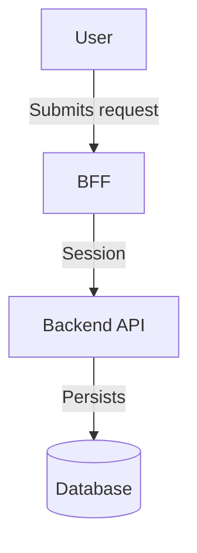

# Documentation Standards (init-project reference)

Source of truth: `codebase-auditor/rules/documentation.md`

## Required files and directories

| Artifact | Location | Notes |
|----------|----------|-------|
| `README.md` | Root | See structure below |
| `AGENTS.md` | Root | AI agent context; use `agents-template.md` |
| `CHANGELOG.md` | Root | Keep a Changelog format |
| `.env.example` | Root | Key names only — no real secrets |
| `docs/architecture/` | `docs/` | Component diagrams, sequence diagrams |
| `docs/api/` | `docs/` | OpenAPI specification |
| `docs/data-model/` | `docs/` | ERD, table descriptions |
| `docs/processes/` | `docs/` | Business process diagrams (BPMN) |
| `docs/adr/` | `docs/` | Architecture Decision Records |

## README.md structure

```markdown
# Project Name

Short description of what the project does and who it is for.

## Prerequisites
Required tools and versions (Node 20+, Java 21+, Docker, etc.).

## Local Development Setup
Step-by-step instructions so a new developer can start without extra support.

## Configuration
Environment variables and their descriptions (reference `.env.example`).

## Testing
How to run tests and what to validate in coverage reports.

## Architecture
Short architecture summary and links to `docs/architecture/`.

## Contributing
Branch strategy, commit conventions, and MR process.
```

## ADR format

Naming: `docs/adr/ADR-NNN-decision-title.md`

```markdown
# ADR-001: [Decision Title]

## Status
Accepted

## Context
[What problem existed? What constraints applied?]

## Decision
[What we decided and why]

## Alternatives
[What other options we considered and why they were not suitable]

## Consequences
[What changes as a result — positive and negative]
```

ADRs are immutable. A new decision → a new ADR referencing the previous one.

## Diagram formats

Prefer text-based formats (Mermaid, PlantUML) so they can be diffed:



## Language rules

- All repository deliverables default to **English**
- Estonian is permitted only when the user provides an explicit prior instruction
