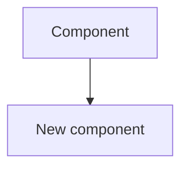

# Updating Documentation

Every change must be documented **before the MR is merged**.

**Language rule:** All documentation defaults to **English** — `README.md`, `CHANGELOG.md`, `AGENTS.md`, `docs/*`, ADRs, OpenAPI descriptions. Estonian is permitted only when the user explicitly requests it for a specific piece of work.

---

## Safety rules

- Update documentation based on actual code changes, not from memory or reconstruction.
- Do not update `CHANGELOG.md` entries that describe changes not yet in the codebase.
- ADRs are immutable — never edit an existing ADR. Create a new one that references the prior decision.
- All documentation defaults to English unless the user explicitly requests otherwise for specific content.

---

## Step 0 — Assess what changed

Before updating any file, confirm the scope of the change by reviewing recent work in context, or running:

```bash
git diff HEAD~1 --stat
# or on a feature branch:
git log develop..HEAD --oneline
```

This ensures changelog entries and doc updates accurately reflect the real change, not a reconstruction from memory.

---

## Step 1 — Updating CHANGELOG.md (always required)

Open `CHANGELOG.md` and add the change under `[Unreleased]` in the correct category:

| Category | Use |
|----------|-----|
| `Added` | New functionality |
| `Changed` | Changes to existing behaviour |
| `Deprecated` | To be removed soon |
| `Removed` | Removed functionality |
| `Fixed` | Bug fixes |
| `Security` | Security fixes |

**Format:**
```markdown
## [Unreleased]
### Added
- Automatic calculation of report approval deadline (#42)
```

> The description must be **understandable to the user**, not a technical commit message.

---

## Step 2 — Updating README.md (when needed)

Update `README.md` when:
- The change affects application behaviour from the user's perspective
- A new configuration option was added (also add it to `.env.example`)
- Testing or run commands changed

---

## Step 3 — Updating AGENTS.md (when needed)

Update `AGENTS.md` when:
- The technology stack changed
- Project structure changed (new folders, modules, services)
- A key convention changed (auth pattern, UUID strategy, coverage target, etc.)

---

## Step 4 — Architecture diagrams (when needed)

Update `docs/architecture/` when:
- A new component or service was added
- Interaction between components changed
- Data flow changed

Prefer diagrams in Mermaid format (diff-friendly):


---

## Step 5 — Data model (when needed)

Update `docs/data-model/` when:
- A database migration was added or modified
- A table, column, or relationship changed

---

## Step 6 — Architecture Decision Record (when needed)

Create a new ADR in `docs/adr/` when a significant architectural decision was made:
- Choosing new technology or a framework
- Choosing an architecture pattern
- Establishing an important convention
- Documenting a deliberate trade-off

Naming: `docs/adr/ADR-NNN-decision-title.md`

```markdown
# ADR-001: [Decision Title]

## Status
Accepted

## Context
[What problem existed? What constraints applied?]

## Decision
[What we decided and why]

## Alternatives
[What other options we considered and why they were not suitable]

## Consequences
[What changes as a result — positive and negative]
```

ADRs are **immutable** — a new decision creates a new ADR referencing the previous one.

---

## Step 7 — OpenAPI specification (when needed)

Update `docs/api/` when:
- A new endpoint was added
- An existing endpoint's request/response schema changed
- Status codes or error formats changed

---

## Step 8 — Confirmation

Provide a summary:

```
Documentation update:
- CHANGELOG.md:   ✅ Updated in [Unreleased] section
- README.md:      ✅ Updated / ⏭ No change needed
- AGENTS.md:      ✅ Updated / ⏭ No change needed
- Architecture:   ✅ Updated / ⏭ No change needed
- Data model:     ✅ Updated / ⏭ No change needed
- ADR:            ✅ Created ADR-NNN / ⏭ No change needed
- OpenAPI:        ✅ Updated / ⏭ No change needed
```
